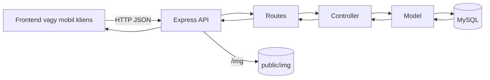

# Backend dokumentáció – Autókereskedés

**Áttekintés**

Az autókereskedés backendje egy Node.js és Express alapú REST API, amely a webes frontend és a mobil kliens közös kiszolgálását végzi. A szerver feladata az autók adatainak lekérdezése és szűrése, a felhasználói hitelesítés, a profilkezelés, az érdeklődések és üzenetek kezelése, valamint az admin felület működéséhez szükséges autókezelési, képfeltöltési és számlázási műveletek biztosítása.

A backend nemcsak adatforrásként működik, hanem a projekt szervező gerince is: itt található a kliensalkalmazások által használt üzleti logika, a jogosultsági ellenőrzések jelenlegi megvalósítása, illetve a statikus képek kiszolgálása is a `/img` útvonalon keresztül.

**A backend szerepe a rendszerben**

Jelenlegi feladatai röviden:
- nyilvános autólista, autóadatlap, ajánlott autók és véletlenszerű ajánlatok kiszolgálása;
- bejelentkezés, regisztráció, profillekérés, profilmódosítás és jelszócsere;
- érdeklődési és üzenetküldési folyamatok kezelése;
- admin felület támogatása autófelvitellel, szerkesztéssel, segédadat-kezeléssel és képfeltöltéssel;
- számlaadatok lekérése, számla és rendelés mentése.

**Felépítés és fő komponensek**

A backend MVC-szerű szerkezetet követ. Külön service réteg jelenleg nincs, ezért a vezérlők közvetlenül a modellekkel dolgoznak. Ez a megoldás egyszerű és jól követhető, ugyanakkor a projekt további bővítésénél érdemes lehet a logikát később rétegezettebben szétválasztani.

Főbb fájlok és felelősségek:
- `backend/app.js`: Express alkalmazás inicializálása, middleware-ek, CORS és route-ok bekötése.
- `backend/bin/www`: HTTP szerver indítása.
- `backend/routes/autoMod.js`: a végpontok definíciója.
- `backend/controllers/autoControllerMod.js`: vezérlőlogika, tokenkezelés, képfeltöltés, számla mentés.
- `backend/models/autoModellMod.js`: SQL műveletek és adatbázis-elérés.
- `backend/middleware/authAuto.js`: JWT ellenőrzés és `req.user` beállítása.
- `backend/config/db.js`: MySQL kapcsolat pool konfiguráció.
- `backend/public/img`: a kliensoldalról elérhető képek mappája.
- `backend/tmp`: ideiglenes feltöltési mappa a `multer` számára.

Adatáramlás:


Technológiai alapok:
- JavaScript (Node.js)
- Express 4.16.1
- `mysql2/promise`
- `jsonwebtoken` és `bcrypt`
- `multer`
- `cors`, `cookie-parser`, `morgan`, `dotenv`
- `nodemon`

Kapcsolódó rendszerek:
- a webes frontend a `frontend` mappából használja az API-t;
- a mobil kliens a `mobil` mappából szintén ugyanezt a backendet éri el;
- külső fizetési vagy e-mail integráció jelenleg nincs.

**Adatbázis és adatmodellezés**
Adatbázis séma és ER összefoglaló:
- Az adatbázis fő táblái: `autok`, `vevok`, `erdeklodesek`, `uzenet`, `szamla`, `rendeles`.
- Törzsadat táblák: `marka`, `valtok`, `uzemanyag`, `szin`, `fizmodo`.
- Nézet: `osszes_auto` a `autok` + törzsadatok JOIN-olt lekérdezéséhez.

Főbb táblák, mezők és típusok:
- `autok`: `id` int PK, `marka_id` int FK, `model` varchar(100), `valto_id` int FK, `kiadasiev` int, `uzemanyag_id` int FK, `motormeret` int, `km` int, `ar` int, `ajtoszam` int, `szemelyek` int, `szin_id` int FK, `irat` tinyint(1) default 1, `leiras` varchar(200).
- `marka`: `id` int PK, `nev` varchar(50), `nev` unique.
- `valtok`: `id` int PK, `nev` varchar(50), `nev` unique.
- `uzemanyag`: `id` int PK, `nev` varchar(50), `nev` unique.
- `szin`: `id` int PK, `nev` varchar(50), `nev` unique.
- `vevok`: `id` int PK, `nev` varchar(70), `lakcim` varchar(255), `adoszam` varchar(40) unique, `jelszo` varchar(255), `email` varchar(50), `admin` tinyint default 0.
- `erdeklodesek`: `id` int PK, `vevo_id` int FK, `auto_id` int FK, `created_at` timestamp default CURRENT_TIMESTAMP.
- `uzenet`: `id` int PK, `vevo_id` int FK, `auto_id` int FK, `elkuldve` date, `uzenet_text` text, `valasz` text, `valasz_datum` date NULL.
- `szamla`: `szamlaid` varchar(255) PK, `felhasz_id` int FK, `kelt_datum` date, `tel_datum` date, `fiz_datim` date, `fiz_id` int FK.
- `rendeles`: `id` int PK, `szid` varchar(255) FK -> `szamla.szamlaid`, `auto_Id` int FK -> `autok.id`.
- `fizmodo`: `id` int PK, `mod` varchar(255).

Kapcsolatok:
- `autok` 1:N kapcsolatban van `erdeklodesek` és `uzenet` táblákkal.
- `vevok` 1:N kapcsolatban van `erdeklodesek` és `uzenet` táblákkal.
- `szamla` 1:N kapcsolatban van `rendeles` táblával.
- `fizmodo` 1:N kapcsolatban van `szamla` táblával.
- `autok` N:1 kapcsolatban van a törzsadat táblákkal (`marka`, `valtok`, `uzemanyag`, `szin`).

Indexek, kulcsok és constraint-ek:
- Minden fő táblában elsődleges kulcs (`PRIMARY KEY`) van.
- Külső kulcsok biztosítják az adatintegritást (pl. `autok.marka_id` -> `marka.id`).
- Egyedi kulcsok: `marka.nev`, `valtok.nev`, `uzemanyag.nev`, `szin.nev`, `vevok.adoszam`.

Nézet (view): `osszes_auto`
- Cél: az `autok` tábla kiegészítése a márka, szín, üzemanyag és váltó megnevezésével.
- Forrás: `autok` JOIN `marka` JOIN `szin` JOIN `uzemanyag` JOIN `valtok`.
- Főbb mezők: `id`, `nev` (márka), `szin_nev`, `model`, `ajtoszam`, `ar`, `km`, `motormeret`, `kiadasiev`, `üzemanyag`, `váltó`, `leírás`, `irat`, `szemelyek`.

Adatmigrációk és seed adatok:
- Migrációs rendszer nincs.
- A teljes séma és seed adat a `mentes/automentvegleges.sql` fájlban található.
- A seed tartalmaz autókat, márkákat, színeket, üzemanyagokat, váltókat, fizetési módokat és teszt felhasználókat.

**API dokumentáció**

Alap útvonal: minden végpont a `/auto` prefix alatt érhető el.

Hitelesítés:
- a védett végpontok `Authorization: Bearer <accessToken>` fejlécet várnak;
- a refresh token `refreshToken` néven HTTP-only cookie-ban tárolódik;
- az access token 15 percig, a refresh token 7 napig érvényes.

Végpontok összefoglaló táblázata:

| Metódus | Útvonal | Auth | Leírás |
|---|---|---|---|
| GET | `/auto/minden` | Nem | Összes autó listázása `limit` és `offset` query paraméterekkel. |
| GET | `/auto/egy/:id` | Nem | Egy autó részletei. |
| DELETE | `/auto/torol/:id` | Nem | Autó törlése. A webes admin felület használja, de a backend jelenleg nem védi. |
| GET | `/auto/marka` | Nem | Márkák listája. |
| GET | `/auto/szin` | Nem | Színek listája. |
| GET | `/auto/uzemanyag` | Nem | Üzemanyagok listája. |
| GET | `/auto/valtok` | Nem | Váltók listája. |
| GET | `/auto/ajtok` | Nem | Ajtószám opciók. |
| GET | `/auto/szemelyek` | Nem | Személy opciók. |
| GET | `/auto/count` | Nem | Autók száma. |
| GET | `/auto/ajanlott/:marka` | Nem | Ajánlott autók ugyanazon márka alapján. |
| GET | `/auto/random` | Nem | Véletlenszerűen kiválasztott autók. |
| POST | `/auto/szuro` | Nem | Többmezős szűrés és lapozás. |
| POST | `/auto/login` | Nem | Bejelentkezés, access token + refresh cookie. |
| POST | `/auto/regisztracio` | Nem | Regisztráció. |
| POST | `/auto/refresh` | Cookie | Új access token kiadása a refresh cookie alapján. |
| POST | `/auto/logout` | Cookie | Refresh cookie törlése. |
| GET | `/auto/profil` | JWT | Saját profil adatok lekérése. |
| PUT | `/auto/profilmodosit` | JWT | Profil adatok módosítása. |
| PUT | `/auto/jelszomodositas` | JWT | Jelszó módosítása. |
| POST | `/auto/erdekel` | JWT | Érdeklődés rögzítése. |
| GET | `/auto/erdekeltek` | JWT | Saját érdeklődött autók listája. |
| POST | `/auto/uzenet` | JWT | Új üzenet küldése. |
| GET | `/auto/uzenetek` | JWT | Saját üzenetszálak lekérése. |
| POST | `/auto/adminuzenetek` | JWT | Megválaszolatlan üzenetek listája. |
| GET | `/auto/chatablak` | JWT | Egy felhasználó és autó chat előzményei. |
| POST | `/auto/admin/chatablak` | JWT | Admin válasz mentése. |
| POST | `/auto/felhasznalo/chatablak` | JWT | Új felhasználói chat üzenet mentése. |
| GET | `/auto/szamla` | JWT | Számlához szükséges adatok lekérése. |
| POST | `/auto/szamla` | JWT | Számla és rendelés mentése. |
| PUT | `/auto/szerkesztes/:id` | JWT | Autó szerkesztése. |
| POST | `/auto/ujauto` | JWT | Új autó felvitele. |
| POST | `/auto/addszin` | JWT | Új szín felvitele. |
| POST | `/auto/adduzemanyag` | JWT | Új üzemanyag felvitele. |
| POST | `/auto/addmodell` | JWT | Új márka felvitele. |
| POST | `/auto/addvalto` | JWT | Új váltó felvitele. |
| POST | `/auto/kepek/:autoId` | JWT | Kép feltöltése `multipart/form-data` formában. |
| DELETE | `/auto/kepek/:autoId/:index` | JWT | Egy kép törlése. |
| GET | `/auto/admin/unansweredcount` | Nem | Megválaszolatlan üzenetek száma. |

Példák:

- `POST /auto/login`
```json
{
  "email": "valaki@pelda.hu",
  "password": "titkosjelszo"
}
```

Válasz:
```json
{
  "accessToken": "...",
  "user": { "id": 1, "email": "valaki@pelda.hu", "admin": 0 }
}
```

- `POST /auto/szuro`
```json
{
  "markak": ["Hyundai", "Suzuki"],
  "uzemanyag": ["Diesel"],
  "szin": ["fekete"],
  "valto": ["Manual"],
  "ajto": [3, 5],
  "szemely": [4, 5],
  "arRange": [3000000, 8000000],
  "kmRange": [0, 80000],
  "evjarat": [2018, 2024],
  "irat": true,
  "motormeret": 1200,
  "keres": "i20",
  "limit": 10,
  "page": 1
}
```

- `POST /auto/erdekel`
```json
{ "autoId": 42 }
```

- `POST /auto/uzenet`
```json
{ "autoId": 42, "uzenet": "Érdeklődnék az autó iránt." }
```

- `POST /auto/kepek/:autoId`
A feltöltés `multipart/form-data` formában történik, a fájlmező neve `file`.

Jogosultsági megjegyzések:
- a `JWT` jelölés jelenleg tokenellenőrzést jelent, nem teljes szerepkör-ellenőrzést;
- a webes admin felület kliensoldali védelmet használ, de a backend több admin jellegű végpontnál nem vizsgálja külön az `admin` flaget;
- a `/auto/torol/:id` és a `/auto/admin/unansweredcount` végpont jelenleg token nélkül is elérhető.

**Biztonság**

A backend biztonsági megoldásai részben már működnek, részben még továbbfejlesztésre szorulnak.

Jelenlegi állapot:
- a jelszavak `bcrypt` hash formában kerülnek tárolásra;
- a legtöbb SQL művelet paraméterezett lekérdezést használ;
- a szűrő végpont dinamikusan építi a lekérdezést, ezért ott további szerveroldali validáció javasolt;
- a `refreshToken` cookie `httpOnly`, de jelenleg `secure: false` beállítással működik;
- a CORS konfiguráció fejlesztői környezetre van szabva (`origin: true`, `credentials: true`);
- központi inputvalidáció és részletes admin jogosultságkezelés még nincs.

**Hibakezelés és logolás**

A backend hibakezelése jelenleg egyszerű, de átlátható.
- a hibák többsége 500-as státuszkóddal és `{ message }` szerkezettel tér vissza;
- egységes hibakezelő middleware nincs;
- a naplózás `morgan('dev')`, `console.log` és `console.error` használatával történik;
- monitoring és automatikus riasztás nincs beépítve.

**Üzemeltetés**

Környezeti változók:
- `DB_HOST`, `DB_USER`, `DB_PASSWORD`, `DB_DATABASE`, `DB_PORT`
- `ACCESS_SECRET`, `REFRESH_SECRET`

Futtatás:
- indítás: `npm start`
- a szerver a `backend/bin/www` fájlból indul;
- a HTTP port jelenleg a `DB_PORT` környezeti változóból kerül kiolvasásra.

Aktuális üzemeltetési állapot:
- Docker vagy Kubernetes konfiguráció nincs;
- több környezetre bontott konfiguráció nincs;
- automatizált mentési és visszaállítási folyamat nincs;
- a jelenlegi szerkezet elsősorban fejlesztői és iskolai bemutatási környezetre alkalmas.

**Tesztelés és továbbfejlesztés**

A projektben jelenleg nem található automatikus backend tesztkészlet, ezért a végpontok ellenőrzése főként manuális próbákkal és a klienseken keresztül történik.

Javasolt következő lépések:
- egységes inputvalidáció bevezetése;
- valódi admin jogosultságellenőrzés kialakítása;
- automatizált API tesztek készítése `Jest` és `Supertest` használatával;
- a futtatási konfiguráció szétválasztása fejlesztői és éles környezetre.
