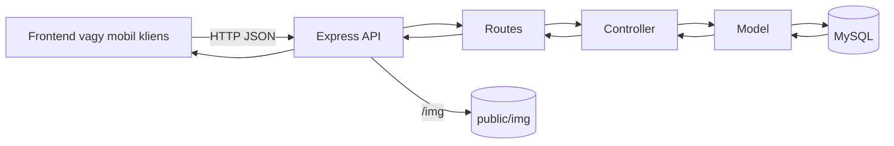

# Backend dokumentáció – Autókereskedés

**Áttekintés**
A backend egy Node.js + Express alapú REST API, amelyet a webes frontend és a mobil kliens is használ. A szerver az autók listázását, részletek lekérését, összetett szűrését, a felhasználói hitelesítést, a profilkezelést, az érdeklődési és üzenetkezelési folyamatokat, valamint az admin felülethez tartozó autó-, képfeltöltési és nyomtatványos műveleteket szolgálja ki. A statikus autóképek a `backend/public/img` mappából érhetők el a `/img` útvonalon.

**A rendszer célja és funkciója**
- Nyilvános autólista, autóadatlap, ajánlott autók és véletlenszerű ajánlatok kiszolgálása.
- JWT alapú bejelentkezés, regisztráció, profillekérés, profilmódosítás és jelszócsere.
- Érdeklődési és üzenetküldési folyamatok kezelése a felhasználói oldalon.
- Admin felület támogatása: autók létrehozása, szerkesztése, képfeltöltés, segédadatok bővítése.
- Számlaadatok lekérése és számla/rendelés mentése.

**Rövid architektúra leírás**
A backend MVC-szerű felépítést követ. Az útvonalak a kontrollerekhez irányítják a kéréseket, a kontrollerek állítják össze a válaszlogikát, az adatbázis-elérést pedig a modellek végzik. Külön service réteg jelenleg nincs, a vezérlők közvetlenül hívják a modelleket. A JWT ellenőrzést middleware végzi, a képek és egyéb statikus fájlok az Express statikus kiszolgálásán keresztül érhetők el.

**Fő komponensek és modulok**
- `backend/app.js`: Express alkalmazás inicializálása, middleware-ek és route-ok bekötése.
- `backend/bin/www`: HTTP szerver indítása.
- `backend/routes/autoMod.js`: az összes REST végpont definíciója.
- `backend/controllers/autoControllerMod.js`: vezérlőlogika, tokenkezelés, képfeltöltés, számla mentés.
- `backend/models/autoModellMod.js`: SQL lekérdezések és adatbázis műveletek.
- `backend/middleware/authAuto.js`: JWT ellenőrzés és `req.user` beállítása.
- `backend/config/db.js`: MySQL kapcsolat pool konfiguráció.
- `backend/public/img`: kiszolgált képek mappája.
- `backend/tmp`: ideiglenes feltöltési mappa a `multer` számára.

**Technológiai stack**
- Nyelv: JavaScript (Node.js).
- Framework: Express 4.16.1.
- Adatbázis driver: `mysql2/promise` 3.15.3.
- Hitelesítés: `jsonwebtoken` 9.0.2, `bcrypt` 6.0.0.
- Fájlkezelés: `multer` 2.0.2.
- Middleware-ek: `cors`, `cookie-parser`, `morgan`, `dotenv`.
- Fejlesztői futtatás: `nodemon`.

**Rendszerarchitektúra**
Modulok és rétegek:
- Route réteg: `backend/routes/autoMod.js`
- Controller réteg: `backend/controllers/autoControllerMod.js`
- Model réteg: `backend/models/autoModellMod.js`
- Middleware réteg: `backend/middleware/authAuto.js`

Adatáramlás:


Összefüggések más rendszerekkel:
- A webes frontend a `frontend` mappából, a mobil kliens a `mobil` mappából használja ugyanazt az API-t.
- A képek közvetlenül a backend `/img` útvonalán érhetők el.
- Külső fizetési vagy e-mail integráció jelenleg nincs.

Skálázási és deployment megjegyzések:
- Jelenleg egyetlen Node.js folyamat fut.
- Külön service layer, queue vagy cache nincs.
- A jelenlegi kód egyszerű fejlesztői/iskolai futtatásra van optimalizálva.

**Adatbázis és adatmodellezés**
Adatbázis séma és ER összefoglaló:
- Az adatbázis fő táblái: `autok`, `vevok`, `erdeklodesek`, `uzenet`, `szamla`, `rendeles`.
- Törzsadat táblák: `marka`, `valtok`, `uzemanyag`, `szin`, `fizmodo`.
- Nézet: `osszes_auto` a `autok` + törzsadatok JOIN-olt lekérdezéséhez.

Főbb táblák, mezők és típusok:
- `autok`: `id` int PK, `marka_id` int FK, `model` varchar(100), `valto_id` int FK, `kiadasiev` int, `uzemanyag_id` int FK, `motormeret` int, `km` int, `ar` int, `ajtoszam` int, `szemelyek` int, `szin_id` int FK, `irat` tinyint(1) default 1, `leiras` varchar(200).
- `marka`: `id` int PK, `nev` varchar(50), `nev` unique.
- `valtok`: `id` int PK, `nev` varchar(50), `nev` unique.
- `uzemanyag`: `id` int PK, `nev` varchar(50), `nev` unique.
- `szin`: `id` int PK, `nev` varchar(50), `nev` unique.
- `vevok`: `id` int PK, `nev` varchar(70), `lakcim` varchar(255), `adoszam` varchar(40) unique, `jelszo` varchar(255), `email` varchar(50), `admin` tinyint default 0.
- `erdeklodesek`: `id` int PK, `vevo_id` int FK, `auto_id` int FK, `created_at` timestamp default CURRENT_TIMESTAMP.
- `uzenet`: `id` int PK, `vevo_id` int FK, `auto_id` int FK, `elkuldve` date, `uzenet_text` text, `valasz` text, `valasz_datum` date NULL.
- `szamla`: `szamlaid` varchar(255) PK, `felhasz_id` int FK, `kelt_datum` date, `tel_datum` date, `fiz_datim` date, `fiz_id` int FK.
- `rendeles`: `id` int PK, `szid` varchar(255) FK -> `szamla.szamlaid`, `auto_Id` int FK -> `autok.id`.
- `fizmodo`: `id` int PK, `mod` varchar(255).

Kapcsolatok:
- `autok` 1:N kapcsolatban van `erdeklodesek` és `uzenet` táblákkal.
- `vevok` 1:N kapcsolatban van `erdeklodesek` és `uzenet` táblákkal.
- `szamla` 1:N kapcsolatban van `rendeles` táblával.
- `fizmodo` 1:N kapcsolatban van `szamla` táblával.
- `autok` N:1 kapcsolatban van a törzsadat táblákkal (`marka`, `valtok`, `uzemanyag`, `szin`).

Indexek, kulcsok és constraint-ek:
- Minden fő táblában elsődleges kulcs (`PRIMARY KEY`) van.
- Külső kulcsok biztosítják az adatintegritást (pl. `autok.marka_id` -> `marka.id`).
- Egyedi kulcsok: `marka.nev`, `valtok.nev`, `uzemanyag.nev`, `szin.nev`, `vevok.adoszam`.

Nézet (view): `osszes_auto`
- Cél: az `autok` tábla kiegészítése a márka, szín, üzemanyag és váltó megnevezésével.
- Forrás: `autok` JOIN `marka` JOIN `szin` JOIN `uzemanyag` JOIN `valtok`.
- Főbb mezők: `id`, `nev` (márka), `szin_nev`, `model`, `ajtoszam`, `ar`, `km`, `motormeret`, `kiadasiev`, `üzemanyag`, `váltó`, `leírás`, `irat`, `szemelyek`.

Adatmigrációk és seed adatok:
- Migrációs rendszer nincs.
- A teljes séma és seed adat a `mentes/automentvegleges.sql` fájlban található.
- A seed tartalmaz autókat, márkákat, színeket, üzemanyagokat, váltókat, fizetési módokat és teszt felhasználókat.

**API dokumentáció**
Alap útvonal: minden végpont a `/auto` prefix alatt érhető el.

Hitelesítés:
- A védett végpontok `Authorization: Bearer <accessToken>` fejlécet várnak.
- A refresh token `refreshToken` néven HTTP-only cookie-ban tárolódik.
- Az access token 15 percig, a refresh token 7 napig érvényes.

Végpontok összefoglaló táblázata:
| Metódus | Útvonal | Auth | Leírás |
|---|---|---|---|
| GET | `/auto/minden` | Nem | Összes autó listázása `limit` és `offset` query paraméterekkel. |
| GET | `/auto/egy/:id` | Nem | Egy autó részletei. |
| DELETE | `/auto/torol/:id` | Nem | Autó törlése. A webes admin felület használja, de a backend jelenleg nem védi. |
| GET | `/auto/marka` | Nem | Márkák listája. |
| GET | `/auto/szin` | Nem | Színek listája. |
| GET | `/auto/uzemanyag` | Nem | Üzemanyagok listája. |
| GET | `/auto/valtok` | Nem | Váltók listája. |
| GET | `/auto/ajtok` | Nem | Ajtószám opciók. |
| GET | `/auto/szemelyek` | Nem | Személy opciók. |
| GET | `/auto/count` | Nem | Autók száma. |
| GET | `/auto/ajanlott/:marka` | Nem | Ajánlott autók ugyanazon márka alapján. |
| GET | `/auto/random` | Nem | Véletlenszerűen kiválasztott autók. |
| POST | `/auto/szuro` | Nem | Többmezős szűrés és lapozás. |
| POST | `/auto/login` | Nem | Bejelentkezés, access token + refresh cookie. |
| POST | `/auto/regisztracio` | Nem | Regisztráció. |
| POST | `/auto/refresh` | Cookie | Új access token kiadása a refresh cookie alapján. |
| POST | `/auto/logout` | Cookie | Refresh cookie törlése. |
| GET | `/auto/profil` | JWT | Saját profil adatok lekérése. |
| PUT | `/auto/profilmodosit` | JWT | Profil adatok módosítása. |
| PUT | `/auto/jelszomodositas` | JWT | Jelszó módosítása. |
| POST | `/auto/erdekel` | JWT | Érdeklődés rögzítése. |
| GET | `/auto/erdekeltek` | JWT | Saját érdeklődött autók listája. |
| POST | `/auto/uzenet` | JWT | Új üzenet küldése. |
| GET | `/auto/uzenetek` | JWT | Saját üzenetszálak lekérése. |
| POST | `/auto/adminuzenetek` | JWT | Megválaszolatlan üzenetek listája. |
| GET | `/auto/chatablak` | JWT | Egy felhasználó és autó chat előzményei. |
| POST | `/auto/admin/chatablak` | JWT | Admin válasz mentése. |
| POST | `/auto/felhasznalo/chatablak` | JWT | Új felhasználói chat üzenet mentése. |
| GET | `/auto/szamla` | JWT | Számlához szükséges adatok lekérése. |
| POST | `/auto/szamla` | JWT | Számla és rendelés mentése. |
| PUT | `/auto/szerkesztes/:id` | JWT | Autó szerkesztése. |
| POST | `/auto/ujauto` | JWT | Új autó felvitele. |
| POST | `/auto/addszin` | JWT | Új szín felvitele. |
| POST | `/auto/adduzemanyag` | JWT | Új üzemanyag felvitele. |
| POST | `/auto/addmodell` | JWT | Új márka felvitele. |
| POST | `/auto/addvalto` | JWT | Új váltó felvitele. |
| POST | `/auto/kepek/:autoId` | JWT | Kép feltöltése `multipart/form-data` formában. |
| DELETE | `/auto/kepek/:autoId/:index` | JWT | Egy kép törlése. |
| GET | `/auto/admin/unansweredcount` | Nem | Megválaszolatlan üzenetek száma. |

Paraméterek és request body példák:
- `POST /auto/login`
```json
{
  "email": "valaki@pelda.hu",
  "password": "titkosjelszo"
}
```
Válasz:
```json
{
  "accessToken": "...",
  "user": { "id": 1, "email": "valaki@pelda.hu", "admin": 0 }
}
```

- `POST /auto/szuro`
```json
{
  "markak": ["Hyundai", "Suzuki"],
  "uzemanyag": ["Diesel"],
  "szin": ["fekete"],
  "valto": ["Manual"],
  "ajto": [3, 5],
  "szemely": [4, 5],
  "arRange": [3000000, 8000000],
  "kmRange": [0, 80000],
  "evjarat": [2018, 2024],
  "irat": true,
  "motormeret": 1200,
  "keres": "i20",
  "limit": 10,
  "page": 1
}
```

- `POST /auto/erdekel`
```json
{ "autoId": 42 }
```

- `POST /auto/uzenet`
```json
{ "autoId": 42, "uzenet": "Érdeklődnék az autó iránt." }
```

- `POST /auto/kepek/:autoId`
A feltöltés `multipart/form-data` formában történik, a fájlmező neve `file`.

Jogosultsági megjegyzések:
- A `JWT` jelölés jelenleg csak tokenellenőrzést jelent, központi admin szerepkör-ellenőrzést nem.
- Az admin felületet a webes frontend útvonalőrei korlátozzák, de a backend több admin jellegű végpontnál nem vizsgálja külön az `admin` flaget.
- A `/auto/torol/:id` és a `/auto/admin/unansweredcount` végpont jelenleg token nélkül is elérhető.

**Biztonság**
- A jelszavak `bcrypt` hash formában kerülnek tárolásra.
- A legtöbb SQL művelet paraméterezett lekérdezést használ.
- A szűrő végpont dinamikusan építi a lekérdezést, és a `LIMIT/OFFSET` közvetlenül kerül az SQL-be, ezért további szerveroldali validálás javasolt.
- A `refreshToken` cookie `httpOnly`, de jelenleg `secure: false` beállítással működik.
- A CORS konfiguráció `origin: true` és `credentials: true`, ami fejlesztéshez kényelmes, éles környezetben szigorítást igényel.
- Külön admin jogosultságellenőrzés és központi inputvalidáció még nincs.

**Hibakezelés és logolás**
- A hibák többsége 500-as státuszkóddal és `{ message }` struktúrával tér vissza.
- Egységes hibakezelő middleware nincs.
- Naplózás: `morgan('dev')`, valamint több helyen `console.log` és `console.error`.
- Monitoring és alerting nincs beépítve.

**Deployment és üzemeltetés**
Környezeti változók:
- `DB_HOST`, `DB_USER`, `DB_PASSWORD`, `DB_DATABASE`, `DB_PORT`
- `ACCESS_SECRET`, `REFRESH_SECRET`

Futtatás:
- Indítás: `npm start`
- A szerver a `backend/bin/www` fájlból indul.
- A HTTP port jelenleg a `DB_PORT` környezeti változóból kerül kiolvasásra.

Aktuális üzemeltetési állapot:
- Docker vagy Kubernetes konfiguráció nincs.
- Több környezetre bontott konfiguráció nincs.
- Automatizált backup és rollback folyamat nincs.

**Tesztelés**
- Automatikus tesztek jelenleg nem találhatók a projektben.
- A backend főleg manuális teszteléssel használható.
- Javasolt továbblépés: `Jest` + `Supertest`, valamint dokumentált Postman gyűjtemény.
