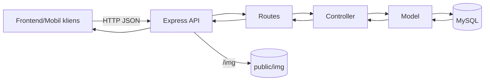

# Backend dokumentáció – Autókereskedés

**Áttekintés**
A backend egy Node.js + Express alapú REST API, amely az autókereskedés adatainak kezelését végzi. A rendszer autók listázását és szűrését, felhasználói regisztrációt és bejelentkezést, érdeklődések és üzenetek kezelését, valamint számlázási adatok rögzítését támogatja. A backend egy MySQL adatbázishoz kapcsolódik, és statikus képek kiszolgálását is elvégzi.

**A rendszer célja és funkciója**
- Autók listázása, részletek lekérése, szűrés, ajánlott és véletlenszerű autók.
- Adminisztrátori műveletek: autók létrehozása, szerkesztése, törlése, segédtáblák bővítése.
- Felhasználói regisztráció, bejelentkezés, token alapú azonosítás.
- Érdeklődések, üzenetek és chat funkció kezelése.
- Számla- és rendelésadatok rögzítése.
- Képfeltöltés és képtörlés.

**Rövid architektúra leírás**
A backend MVC-szerű felépítésű. Az útvonalak (routes) irányítják a kéréseket a kontrollerekhez, a kontrollerek az üzleti logikát végzik, és a modelleken keresztül férnek hozzá az adatbázishoz. A JWT-alapú autentikációt middleware kezeli. Statikus fájlok a `backend/public` mappából szolgálódnak ki.

**Fő komponensek és modulok**
- `backend/app.js`: Express alkalmazás inicializálása, middleware-ek és route-ok bekötése.
- `backend/bin/www`: HTTP szerver indítása és port beállítása.
- `backend/routes/autoMod.js`: REST végpontok listája és middleware-ek.
- `backend/controllers/autoControllerMod.js`: üzleti logika, JWT kezelés, fájlkezelés.
- `backend/models/autoModellMod.js`: adatbázis műveletek, SQL lekérdezések.
- `backend/middleware/authAuto.js`: JWT ellenőrzés és `req.user` beállítás.
- `backend/config/db.js`: MySQL kapcsolat pool konfiguráció.
- `backend/public/img`: autók képei.
- `backend/tmp`: ideiglenes feltöltési mappa (multer).

**Technológiai stack**
- Nyelv: JavaScript (Node.js).
- Framework: Express 4.16.1.
- Adatbázis: MySQL (InnoDB, `utf8mb4_hungarian_ci` kolláció).
- ORM/DB driver: mysql2/promise 3.15.3.
- Autentikáció: jsonwebtoken 9.0.2, bcrypt 6.0.0.
- Fájlkezelés: multer 2.0.2.
- HTTP middleware-ek: cors 2.8.5, cookie-parser 1.4.4, morgan 1.9.1, dotenv 17.2.3.
- Fejlesztői eszköz: nodemon 3.1.10.
- Külső szolgáltatások / API-k: nincs.

**Rendszerarchitektúra**
Modulok és rétegek:
- Controller réteg: `backend/controllers/autoControllerMod.js`.
- Service réteg: nincs külön réteg, a controller közvetlenül hívja a modelleket.
- Repository/Model réteg: `backend/models/autoModellMod.js`.
- Middleware réteg: `backend/middleware/authAuto.js`.

Adatáramlás diagram:


Összefüggések más rendszerekkel:
- A backendet a webes frontend és a mobil kliens fogyasztja REST API-n keresztül.
- Képek kiszolgálása a backend statikus `/img` útvonalán keresztül történik.
- Külső integráció nincs.

Skálázási és deployment koncepciók:
- Jelenleg egyetlen Node.js processz fut, horizontális skálázás nincs konfigurálva.
- Javasolt: több példány futtatása (pl. PM2), reverse proxy (Nginx), és külön statikus fájlkiszolgáló vagy CDN.
- Adatbázis oldalon replikáció és rendszeres mentés javasolt, de nem része a jelenlegi kódnak.

**Adatbázis és adatmodellezés**
Adatbázis séma és ER összefoglaló:
- Az adatbázis fő táblái: `autok`, `vevok`, `erdeklodesek`, `uzenet`, `szamla`, `rendeles`.
- Törzsadat táblák: `marka`, `valtok`, `uzemanyag`, `szin`, `fizmodo`.
- Nézet: `osszes_auto` a `autok` + törzsadatok JOIN-olt lekérdezéséhez.

Főbb táblák, mezők és típusok:
- `autok`: `id` int PK, `marka_id` int FK, `model` varchar(100), `valto_id` int FK, `kiadasiev` int, `uzemanyag_id` int FK, `motormeret` int, `km` int, `ar` int, `ajtoszam` int, `szemelyek` int, `szin_id` int FK, `irat` tinyint(1) default 1, `leiras` varchar(200).
- `marka`: `id` int PK, `nev` varchar(50), `nev` unique.
- `valtok`: `id` int PK, `nev` varchar(50), `nev` unique.
- `uzemanyag`: `id` int PK, `nev` varchar(50), `nev` unique.
- `szin`: `id` int PK, `nev` varchar(50), `nev` unique.
- `vevok`: `id` int PK, `nev` varchar(70), `lakcim` varchar(255), `adoszam` varchar(40) unique, `jelszo` varchar(255), `email` varchar(50), `admin` tinyint default 0.
- `erdeklodesek`: `id` int PK, `vevo_id` int FK, `auto_id` int FK, `created_at` timestamp default CURRENT_TIMESTAMP.
- `uzenet`: `id` int PK, `vevo_id` int FK, `auto_id` int FK, `elkuldve` date, `uzenet_text` text, `valasz` text, `valasz_datum` date NULL.
- `szamla`: `szamlaid` varchar(255) PK, `felhasz_id` int FK, `kelt_datum` date, `tel_datum` date, `fiz_datim` date, `fiz_id` int FK.
- `rendeles`: `id` int PK, `szid` varchar(255) FK -> `szamla.szamlaid`, `auto_Id` int FK -> `autok.id`.
- `fizmodo`: `id` int PK, `mod` varchar(255).

Kapcsolatok:
- `autok` 1:N kapcsolatban van `erdeklodesek` és `uzenet` táblákkal.
- `vevok` 1:N kapcsolatban van `erdeklodesek` és `uzenet` táblákkal.
- `szamla` 1:N kapcsolatban van `rendeles` táblával.
- `fizmodo` 1:N kapcsolatban van `szamla` táblával.
- `autok` N:1 kapcsolatban van a törzsadat táblákkal (`marka`, `valtok`, `uzemanyag`, `szin`).

Indexek, kulcsok és constraint-ek:
- Minden fő táblában elsődleges kulcs (`PRIMARY KEY`) van.
- Külső kulcsok biztosítják az adatintegritást (pl. `autok.marka_id` -> `marka.id`).
- Egyedi kulcsok: `marka.nev`, `valtok.nev`, `uzemanyag.nev`, `szin.nev`, `vevok.adoszam`.

Nézet (view): `osszes_auto`
- Cél: az `autok` tábla kiegészítése a márka, szín, üzemanyag és váltó megnevezésével.
- Forrás: `autok` JOIN `marka` JOIN `szin` JOIN `uzemanyag` JOIN `valtok`.
- Főbb mezők: `id`, `nev` (márka), `szin_nev`, `model`, `ajtoszam`, `ar`, `km`, `motormeret`, `kiadasiev`, `üzemanyag`, `váltó`, `leírás`, `irat`, `szemelyek`.

Adatmigrációk és seed adatok:
- Migrációs rendszer nincs.
- A teljes séma és seed adat a `mentes/automentvegleges.sql` fájlban található.
- A seed tartalmaz autókat, márkákat, színeket, üzemanyagokat, váltókat, fizetési módokat és teszt felhasználókat.

**API dokumentáció**
Alap útvonal: minden végpont a `/auto` prefix alatt érhető el.

Hitelesítés:
- A védett végpontok `Authorization: Bearer <accessToken>` fejlécet várnak.
- A refresh token `refreshToken` néven HTTP-only cookie-ban tárolódik.

Végpontok összefoglaló táblázat:
| Metódus | Útvonal | Auth | Leírás |
|---|---|---|---|
| GET | `/auto/minden` | Nem | Összes autó listázása (query: `limit`, `offset`). |
| GET | `/auto/egy/:id` | Nem | Egy autó részletei. |
| DELETE | `/auto/torol/:id` | Nem | Autó törlése. |
| GET | `/auto/marka` | Nem | Márkák listája. |
| GET | `/auto/szin` | Nem | Színek listája. |
| GET | `/auto/uzemanyag` | Nem | Üzemanyagok listája. |
| GET | `/auto/valtok` | Nem | Váltók listája. |
| GET | `/auto/ajtok` | Nem | Ajtószám opciók. |
| GET | `/auto/szemelyek` | Nem | Személy opciók. |
| GET | `/auto/count` | Nem | Autók száma. |
| GET | `/auto/ajanlott/:marka` | Nem | Ajánlott autók márka alapján. |
| GET | `/auto/random` | Nem | Véletlenszerű autók. |
| POST | `/auto/szuro` | Nem | Szűrő feltételek szerinti listázás. |
| POST | `/auto/login` | Nem | Bejelentkezés, access token + cookie refresh token. |
| POST | `/auto/regisztracio` | Nem | Regisztráció. |
| POST | `/auto/refresh` | Nem | Access token frissítése cookie-ból. |
| POST | `/auto/logout` | Nem | Refresh token törlése. |
| GET | `/auto/profil` | Igen | Saját profil adatok. |
| PUT | `/auto/profilmodosit` | Igen | Profil módosítás. |
| PUT | `/auto/jelszomodositas` | Igen | Jelszó módosítás. |
| POST | `/auto/erdekel` | Igen | Érdeklődés rögzítése. |
| GET | `/auto/erdekeltek` | Igen | Saját érdeklődött autók. |
| POST | `/auto/uzenet` | Igen | Új üzenet küldése. |
| GET | `/auto/uzenetek` | Igen | Saját üzenetek listája. |
| POST | `/auto/adminuzenetek` | Igen | Admin: megválaszolatlan üzenetek. |
| GET | `/auto/chatablak` | Igen | Chat előzmények lekérése. |
| POST | `/auto/admin/chatablak` | Igen | Admin válasz küldése. |
| POST | `/auto/felhasznalo/chatablak` | Igen | Felhasználói válasz küldése. |
| GET | `/auto/szamla` | Igen | Számlához szükséges adatok. |
| POST | `/auto/szamla` | Igen | Számla és rendelés mentése. |
| PUT | `/auto/szerkesztes/:id` | Igen | Autó módosítása. |
| POST | `/auto/ujauto` | Igen | Új autó létrehozása. |
| POST | `/auto/addszin` | Igen | Új szín felvitele. |
| POST | `/auto/adduzemanyag` | Igen | Új üzemanyag felvitele. |
| POST | `/auto/addmodell` | Igen | Új márka felvitele. |
| POST | `/auto/addvalto` | Igen | Új váltó felvitele. |
| POST | `/auto/kepek/:autoId` | Igen | Kép feltöltése (multipart/form-data). |
| DELETE | `/auto/kepek/:autoId/:index` | Igen | Kép törlése. |
| GET | `/auto/admin/unansweredcount` | Nem | Admin: megválaszolatlan üzenetek száma. |

Paraméterek és request body példák:
- `POST /auto/login`
```json
{
  "email": "valaki@pelda.hu",
  "password": "titkosjelszo"
}
```
Válasz:
```json
{
  "accessToken": "...",
  "user": { "id": 1, "email": "valaki@pelda.hu", "admin": 0 }
}
```

- `POST /auto/szuro`
```json
{
  "markak": ["Hyundai", "Suzuki"],
  "uzemanyag": ["Diesel"],
  "szin": ["fekete"],
  "valto": ["Manual"],
  "ajto": [3, 5],
  "szemely": [4, 5],
  "arRange": [3000000, 8000000],
  "kmRange": [0, 80000],
  "evjarat": [2018, 2024],
  "irat": true,
  "motormeret": 1200,
  "keres": "i20",
  "limit": 10,
  "page": 1
}
```

- `POST /auto/erdekel`
```json
{ "autoId": 42 }
```

- `POST /auto/uzenet`
```json
{ "autoId": 42, "uzenet": "Érdeklődnék az autó iránt." }
```

- `POST /auto/kepek/:autoId`
A feltöltés `multipart/form-data` formátumban történik, a fájlmező neve `file`.

Autentikáció és jogosultságok:
- Access token érvényesség: 15 perc.
- Refresh token érvényesség: 7 nap (cookie).
- A token payload az `id`, `email`, `admin` mezőket tartalmazza.
- Admin jogosultság ellenőrzése nincs központilag implementálva, csak token validáció történik.

**Biztonság**
- Jelszavak bcrypt-tel hash-eltek, sima szöveg nem tárolódik.
- SQL injection ellen a legtöbb lekérdezés paraméterezett.
- A szűrő végpont dinamikus SQL-t épít, a `LIMIT/OFFSET` értékek közvetlenül kerülnek be, ezért validálás javasolt.
- CORS beállítás `origin: true` és `credentials: true`, ami fejlesztéshez jó, de élesben szigorítást igényelhet.
- Refresh token cookie `secure: false` értékkel van beállítva, HTTPS környezetben `true` javasolt.
- Input validáció minimális, javasolt központi validáció és hibakezelés (pl. Joi/Zod).

**Hibakezelés és logolás**
- Hibák többsége 500-as státuszkóddal és `{ message }` struktúrával tér vissza.
- Nincs egységes hibakód-katalógus.
- Logolás: `morgan('dev')` és `console.log`/`console.error` a futás során.
- Monitoring és alerting nincs beépítve.

**Deployment és üzemeltetés**
Környezetek:
- A rendszerhez nincs külön `dev/test/prod` konfiguráció, ugyanaz a kód fut mindenhol.

Konfiguráció és környezeti változók:
- `DB_HOST`, `DB_USER`, `DB_PASSWORD`, `DB_DATABASE`, `DB_PORT`.
- `ACCESS_SECRET`, `REFRESH_SECRET`.

Futtatás:
- Indítás: `npm start`.
- A szerver a `backend/bin/www` fájlban indul, a portot a `DB_PORT` változóból veszi.

Docker / Kubernetes:
- Nincs konfiguráció.

Backup és rollback:
- Nincs automatizálva.
- Javasolt: rendszeres `mysqldump` alapú mentés és verzionált SQL dump.

**Tesztelés**
- Automatikus tesztek nem találhatók.
- Javasolt: egységtesztek (Jest), integrációs tesztek (Supertest), valamint Postman gyűjtemény.

**Karbantartás és további fejlesztés**
Kód stílus és konvenciók:
- Nincs formalizált linting vagy formázási szabályrendszer.
- Javasolt: ESLint + Prettier.

Közös utility függvények:
- Jelenleg nincs külön `utils` réteg.

Jövőbeli fejlesztési irányok:
- Egységes validációs réteg és error handler middleware.
- Role-alapú jogosultságkezelés admin funkciókra.
- Rate limiting és audit log a biztonság növeléséhez.
- CI/CD pipeline és automatikus tesztek.

**Tippek hibakereséshez**
- DB kapcsolat hiba esetén ellenőrizd a `.env` változókat és a MySQL elérhetőséget.
- A szerver portját a `DB_PORT` változó vezérli, ami félrevezető lehet, ha adatbázis portot vársz.
- 401-es válasz esetén hiányzik vagy lejárt az `Authorization` token.
- 403-as válasz esetén a refresh token lejárt vagy hibás.
- Képfeltöltéskor a fájlnév és a törlésnél használt `autoId_index` név konzisztenciáját ellenőrizd.
- Szűrő esetén figyelj arra, hogy a `limit` és `page` szám típusú legyen.
- Ha a magyar ékezetes oszlopnevek miatt hibát kapsz, ellenőrizd a DB és a kliens karakterkódolását.
